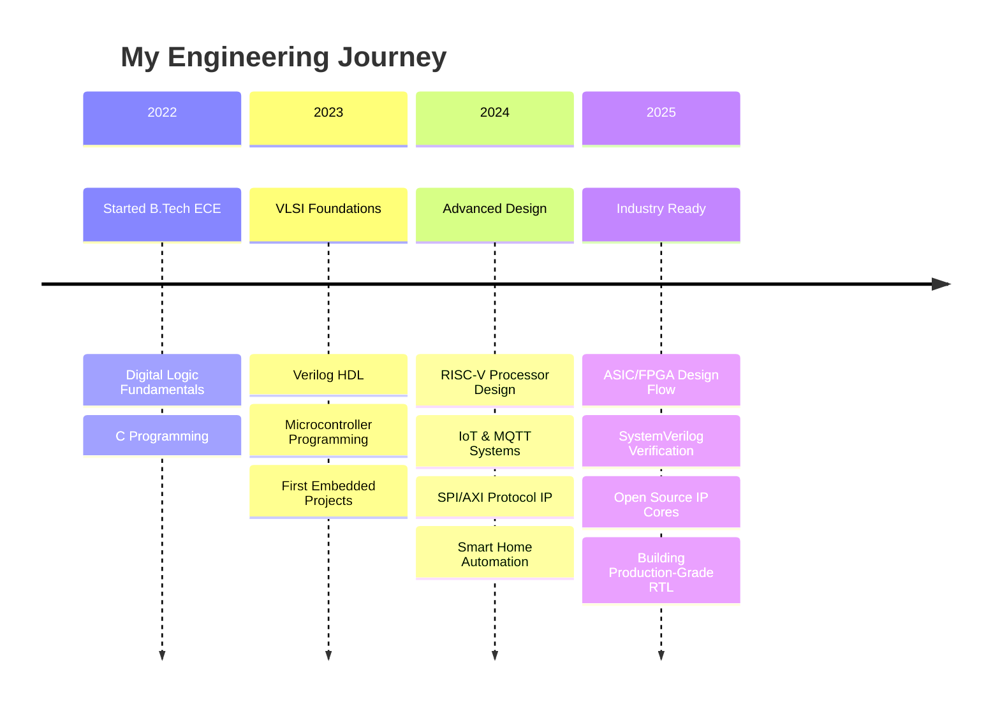

<div align="center">


[](https://github.com/HariKrishna0088)

</div>

---

##  About Me

```verilog
module hari_krishna (
    output wire  passion,
    output wire  innovation,
    output wire  excellence
);

    parameter LOCATION    = "Nellore, Andhra Pradesh, India 🇮🇳";
    parameter EDUCATION   = "B.Tech ECE — JNTUA College of Engineering, Kalikiri";
    parameter TITLE       = "VLSI Design & Embedded Systems Engineer";
    parameter EMAIL       = "haridaggolu@gmail.com";

    parameter FOCUS_AREAS = '{
        "VLSI Frontend Design (RTL → Verification)",
        "Embedded Systems & Microcontroller Programming",
        "IoT Systems — Sensor to Cloud Pipeline",
        "Digital Signal Processing",
        "Hardware-Software Co-Design"
    };

    parameter CURRENT_WORK = '{
        "RISC-V Processor Design in Verilog",
        "SPI & AXI4-Lite Bus Protocol Implementation",
        "IoT Smart Systems with ESP32 + MQTT"
    };

    parameter PHILOSOPHY = "Great hardware is invisible; it just works.";

    assign passion    = 1'b1;
    assign innovation = 1'b1;
    assign excellence = 1'b1;

endmodule
```

I'm a B.Tech ECE student at **JNTUA College of Engineering, Kalikiri**, passionate about designing digital hardware at the RTL level and building intelligent embedded systems. From designing a **RISC-V processor from scratch** to creating **IoT systems that connect sensors to the cloud**, I love turning logic gates into real-world solutions.

---

##  2025 Focus Areas

### 🎯 Learning
- Advanced VLSI Verification (UVM/SystemVerilog)
- ASIC Design Flow (Synthesis → Place & Route)
- FPGA Prototyping on Xilinx & Intel platforms
- RISC-V Architecture extensions

### 🚀 Building
- RISC-V Single-Cycle & Pipelined Processors
- SPI, I2C, AXI4-Lite Bus IP Cores
- IoT Smart Home & Plant Monitoring Systems
- Open Source VLSI IP Cores

### 📚 Reading
- Computer Organization & Design (Patterson & Hennessy)
- Digital Design & Computer Architecture (Harris & Harris)
- CMOS VLSI Design (Weste & Harris)

---

##  Featured VLSI Projects

### 🖥️ [RISC-V Single-Cycle Processor](https://github.com/HariKrishna0088/VLSI-RISCV-SingleCycle-Processor)
**The Crown Jewel** — Complete 32-bit RISC-V processor (RV32I) designed from scratch
- 🏗️ 9 modular Verilog components (PC, RegFile, ALU, Control, Memory)
- 📝 Supports R-type, I-type, S-type, B-type instructions
- ✅ Self-checking testbench with automated verification
- 🔮 Foundation for 5-stage pipelined version

### ⚡ [SPI Master Controller](https://github.com/HariKrishna0088/VLSI-SPI-Master-Controller)
**Industry-Standard Protocol IP** — Configurable SPI Master with multiple modes
- 📡 All 4 SPI modes (CPOL/CPHA combinations)
- 🔧 Parameterized clock divider and data width
- 🔄 Multi-slave support with chip-select logic
- ✅ Loopback testbench

### 🔌 [AXI4-Lite Slave Interface](https://github.com/HariKrishna0088/VLSI-AXI4-Lite-Slave)
**SoC Bus Protocol** — AXI4-Lite slave for AMBA bus integration
- 🏭 Industry-standard ARM AMBA protocol
- 📖 Read/Write channel implementation with handshaking
- 🗂️ Memory-mapped register bank
- 🔬 Comprehensive AXI protocol testbench

### 📡 [UART Transceiver](https://github.com/HariKrishna0088/VLSI-UART-Transceiver-Verilog)
**Serial Communication IP** — Full-duplex UART with configurable baud rate
- 🔄 Independent TX/RX with FSM control
- 🎯 Mid-bit sampling for noise immunity
- 🛡️ Frame error detection
- ✅ Loopback self-verification

### 🗄️ [Synchronous FIFO](https://github.com/HariKrishna0088/VLSI-Synchronous-FIFO)
**Memory IP Core** — Parameterized FIFO with full status flags
- 🔧 Configurable depth and data width
- 🚩 Full/Empty/Almost-Full/Almost-Empty/Overflow/Underflow flags
- 🔄 Simultaneous read-write support

### ⚡ [4-Bit ALU](https://github.com/HariKrishna0088/VLSI-4Bit-ALU-Verilog) · 🚦 [Traffic Light FSM](https://github.com/HariKrishna0088/VLSI-Traffic-Light-Controller)

---

##  Featured IoT & Embedded Projects

### 🏠 [Smart Home Automation](https://github.com/HariKrishna0088/IoT-Smart-Home-Automation)
ESP32 + MQTT + Web Dashboard — Multi-sensor monitoring with auto-control

### 🏥 [Saline Level Monitor](https://github.com/HariKrishna0088/Embedded-Saline-Level-Monitor)
Medical IoT — HX711 load cell + LCD + multi-level alarm system

### ❄️ [Temperature Controlled AC](https://github.com/HariKrishna0088/Embedded-Temperature-Controlled-AC)
DHT11 + Relay + Hysteresis control with compressor protection

### 🌱 [Indoor Plant Monitor](https://github.com/HariKrishna0088/IoT-Indoor-Plant-Monitor)
ESP32 + ThingSpeak cloud + OLED + Auto-watering system

---

## 🛠️ Tech Stack

<div align="center">

### HDL & VLSI Tools


### Embedded & IoT


### Languages & Tools


</div>

---

##  Development Journey



---

## 📊 GitHub Stats

<div align="center">


</div>

---

##  Connect With Me

<div align="center">

[](https://linkedin.com/in/harikrishnadaggolu)
[](mailto:haridaggolu@gmail.com)
[](https://github.com/HariKrishna0088)

</div>

---

<div align="center">

### 🌟 *"Designing the future of silicon, one module at a time."* 🌟

⭐ **If you like my work, consider starring my repositories!** ⭐


</div>

